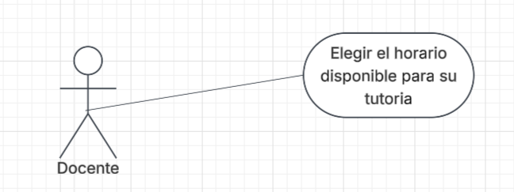
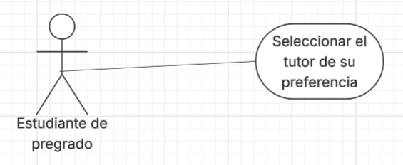
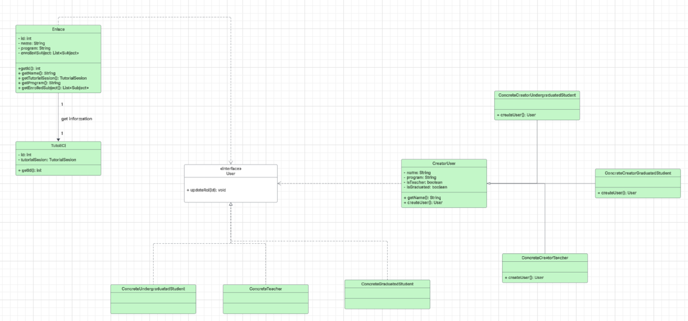

# DOSW - Parcial de Primer Tercio

### Diagrama de Contexto - TutoECI

### Requerimientos del sistema

**Requerimientos funcionales**

1. La plataforma debe permitir seleccionar los horarios libres
disponibles para los tutores (Builder)
2. El usuario estudiante puede filtrar los tutores
de su preferencia
3. La aplicación debe validar que la materia exista
utilizando el sistema Enlace 

**Requerimientos no funcionales**

1. TutoECI debe tener un diseño responsive
2. La identidad visual de la aplicación debe
seguir la paleta de colores de la Escuela

### Historias de usuario

| Campo | Descripción                                                                                                                                                                |
|------|----------------------------------------------------------------------------------------------------------------------------------------------------------------------------|
| **ID** | HU-01                                                                                                                                                                      |
| **Título** | Elegir horario de tutoria                                                                                                                                                  |
| **Descripción** | *Como  docente, quiero elegir un horario para poder realizar la tutoria según la materia que estoy dictando.*                                                              |
| **Prioridad** | Media                                                                                                                                                                      |
| **Justificación** | Esta característica permite que los estudiantes de pregrado puedan elegir a qué hora querrían hacer la tutoria de la materia preferida según el profesor a realizarla. |                                                                                                                                                                                            |
| **Estimación** | 8                                                                                                                                                                          |

| Campo | Descripción                                                                                                                                                                                       |
|------|---------------------------------------------------------------------------------------------------------------------------------------------------------------------------------------------------|
| **ID** | HU-02                                                                                                                                                                                             |
| **Título** | Seleccionar la materia para mi tutoria                                                                                                                                                            |
| **Descripción** | *Como  estudiante de pregrado, quiero seleccionar la materia con la que tengo dudas, para reservar un horario disponible.*                                                                        |
| **Prioridad** | Alta                                                                                                                                                                                              |
| **Justificación** | Además de ser la principal funcionalidad de la plataforma para ofrecerle los servicios a los estudiantes de pregrado, la aplicación permite que el estudiante pueda elegir a su tutor que quiera. |                                                                                                                                                                                            |
| **Estimación** | 8                                                                                                                                                                                                 |

### Diagrama de caso de uso por requerimientos funcionales

1. La plataforma debe permitir seleccionar los horarios libres
   disponibles para los tutores
   

2. El usuario estudiante puede filtrar los tutores
   de su preferencia
   

### Planeación Agile

*Plataforma Jira*

https://davidosalcedo.atlassian.net/jira/software/projects/DP/boards/2/timeline?atlOrigin=eyJpIjoiMzc0M2Q1YmYxNzFkNDg2MDg3NWJiNTZkZTY5ZmY1YzEiLCJwIjoiaiJ9

### Diseño de Software y Patrones

**Primer patrón**

* **Nombre**: Factory Method
* **Tipo de patrón**: Creacional 
* **Justificación**: Se usará el patrón Factory Method con el fin de construir dos interfaces principales: tutorías y usuarios; por ejemplo para tutorías,
de manera que, se define para cada tutoria su propio comportamiento (duración, tutor) y para la otra interfaz, qué rol cumple en la plataforma siguiendo 
el contrato que tenga la interfaz (estudiante de pregrado, docente o estudiante de posgrado)

**Segundo patrón**

* **Nombre**: Command
* **Tipo de patrón**: Comportamiento
* **Justificación**: Este patrón se usará con el fin de permitir que las solicitudes que realice
la plataforma a sistemas externos como Enlace y NotifyMe sobre la validación de materias según su sigla
o dejar en cola la notificación cuando la sesión esté confirmada. 

**Diagrama de clases**

